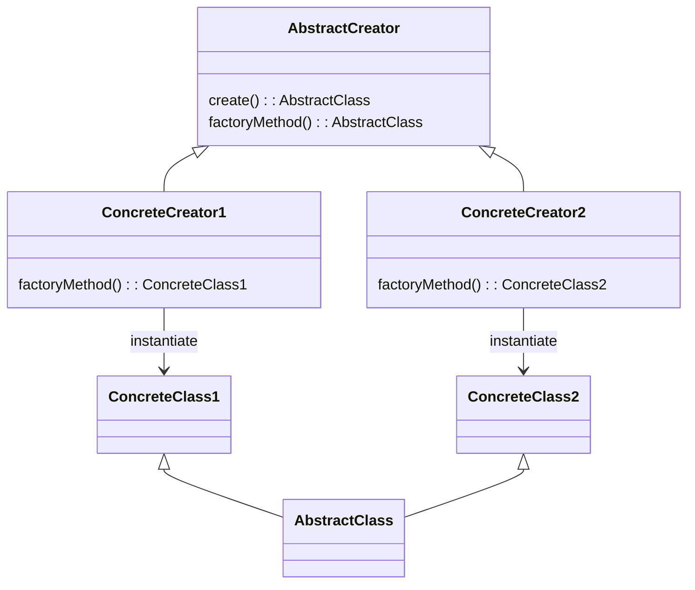

# Software Design and Architecture Week04 Worksheet

There are multiple activities each week, and you will probably not get everything done in the timetabled lab sessions; therefore, it is highly recommended that you complete the labs in your own time each week to avoid falling behind.

Completing the labs will get you ready for writing the assignment code.

**Advanced** Labs are optional, but completing the Advanced Labs will introduce you to more advanced techniques and improve your design skills.

## Hint: Starting a new Project

IntelliJ has a quick and simple way of creating a new Java project that we can use for many of the labs.

Intelli-J File menu -\> New \> Project…

Provide a project name, chose a location and ensure that you have ticked the **Add sample code** box.


# Create Singletons representing Currencies

We want to represent a currency as a class. A currency has

  - A code (String) which a three-letter ISO 4217 currency code (e.g., "GBP", "USD", “EUR”).

  - A name (String): Stores the full name of the currency (e.g., "British Pound", "US Dollar").

  - A symbol (char): Stores the currency symbol (e.g., '£', '$',’ €’).

  - Decimals (int): Stores the number of decimal places typically used for this currency (usually 2).

The currency code uniquely identifies the currency.

The code below is a simple currency ValueObject.

Use Intelli-J File menu -\> New \> Project… to create a new sample project and then write public final static Singletons for the following Currencies:

|      | Code | Name          | Symbol | Decimals |
|------|------|---------------|--------|----------|
| GBP  | GBP  | British Pound | £      | 2        |
| USD  | USD  | US Dollar     | $      | 2        |
| EUR  | EUR  | Euro          | €      | 2        |


```java
class Currency {
    final static char POUND_SYMBOL = '£';
    final static char DOLLAR_SYMBOL = '$';
    final static char EURO_SYMBOL = '€';

    private final String code;
    private final String name;
    private final char symbol;
    private final int  decimals;

    public Currency(String code, String name, char symbol, int decimals) {
        this.code = code;
        this.name = name;
        this.symbol = symbol;
        this.decimals = decimals;
    }

    public String getCode() { 
      return code;  
    }
    public String getName() {
        return name;
    }
    public char getSymbol() {
        return symbol;
    }
    public int getDecimals() {
        return decimals;
    }
}

```

This a Value Object so you need to implement the `equals()`, `hashCode()` and `toString()` methods.

This Value Object has multiple fields, so you need to decide which ones to include in these method implementations.

Hint. To compute a hashCode for multiple fields use

`Objects.hash(Object... values)`

This method is very useful for implementing Object. hashCode() on objects containing multiple fields

In the main method of the test program, write a small program that prints each singleton Currency to the console as

```text
GBP (£)

USD ($)

EUR (€)
```
**Question**: Why is it important that any Singletons are final and immutable?

## Hints and Tips

See the lecture notes and module textbook for a discussion of patterns for creating objects.

Singletons are intended to be single primitive value or single object instance within a program.

In Java static fields can be used to hold constant primitive values or a single instance of an immutable class. If the value is constant, we use the CONSTANT\_NAME naming convention.

# Write a Money Factory using the Abstract Factory pattern.

We could be writing an e-commerce application that will be used in multiple countries. We therefore want to have the concept of Money using different currencies, but we don’t need to mix currencies within a single deployment of our e-commerce application.

Create a Money Value Object that combines a value with the Currency class from the earlier part of the lab.

```java
class Money {

    private final double amount;
    private final Currency currency;

    public Money(double amount, Currency currency) {
        this.currency = currency;
        double factor = Math.pow(amount, currency.getDecimals());
        this.amount = Math.round(amount * factor)/factor; //round to the number of currency decimals
    }

    public double getAmount() {
        return amount;
    }

    public Currency getCurrency() {
        return currency;
    }

    @Override
    public boolean equals(Object o) {
        if (!(o instanceof Money money)) return false;
        return Double.compare(amount, money.amount) == 0 && Objects.equals(currency, money.currency);
    }

    @Override
    public int hashCode() {
        return Objects.hash(amount, currency);
    }

    @Override
    public String toString() {
      // the number of decimals varies by currency
      // create a format string such as ".2f" to display a double to a number of decimals
        String formatString = String.format(".%df", currency.getDecimals());
        return currency.getSymbol() + String.format("%" + formatString , amount);
    }
}

```

Create a MoneyFactory interface

```java
interface MoneyFactory {
  public Money create(double amount);
}

```

Write concrete implementations of this interface for GBP, EUR and USD currencies called GbpMoneyFactory, EurMoneyFactory and UsdMoneyFactory so that this test program code gives the following output.
```text
createMoney(new EurMoneyFactory());
createMoney(new UsdMoneyFactory());
createMoney(new GbpMoneyFactory());

private static void createMoney( MoneyFactory moneyFactory) {
    System.out.format("%s%n", moneyFactory.create(10d));
    System.out.format("%s%n", moneyFactory.create(10.9999d));
    System.out.format("%s%n", moneyFactory.create(0.9999d));
}


Outputs
€10.00
€11.00
€1.00
$10.00
$11.00
$1.00
£10.00
£11.00
£1.00

```
## Hints and Tips

See the lecture notes and module textbook for a discussion of patterns for creating objects.

By changing the concrete type providing the MoneyFactory interface, we can make a single change so that all Money objects created in the program (in our case the createMoney method) have the required currency.

Your concrete factories should use the Currency Singletons you created in the first part of the lab. This is because although we might create millions of instances of Money with different values, but don’t want to create millions of unnecessary instances of Currency.

# Write a Money Creator using a Factory Method

Another common creation pattern is the **Factory Method** pattern. The Factory Method creates objects in a superclass but allows subclasses to alter the type of objects that will be created. It is slightly more complex than the Abstract Factory pattern, but a bit more flexible because it can run code before and after the concrete class is created.

Read the **Factory Method Pattern** section in the module textbook and re-implement the MoneyFactory example using a Factory method.

## Hints and Tips

The general form of the **Factory Method** pattern.

Assume we want to make different concrete classes inherited from an abstract superclass

```java
abstract class AbstractClass {
    public abstract void operation();
}
class ConcreteClass1 extends AbstractClass {
    @Override
    public void operation() {
    }
}
class ConcreteClass2 extends AbstractClass {
    @Override
    public void operation() {
    }
}
```

We make an AbstractCreator which has a `public create()` method and an `abstract protected factoryMethod()`.

Concrete subclasses of the AbstractCreator implement `factoryMethod()` to create concrete classes.

The public `create()` method can contain any common code (if any) that runs before or after the requested object is made and before it is returned to the client.

```java
abstract class AbstractCreator {
    public AbstractClass create()
    {
        return factoryMethod();
    }
    protected abstract AbstractClass factoryMethod();
}
class ConcreteCreator1 extends AbstractCreator {

    @Override
    protected ConcreteClass1 factoryMethod() {
        return new ConcreteClass1();
    }
}
class ConcreteCreator2 extends AbstractCreator {
    @Override
    protected ConcreteClass1 factoryMethod() {
        return new ConcreteClass1();
    }
}

```

As a UML diagram.



Write concrete implementations of an abstract MoneyCreator class for GBP, EUR and USD currencies called GbpMoneyCreator, EurMoneyCreator and UsdMoneyCreator so that this test program code gives the following output.
```text
    createMoney(new EurMoneyCreator());
    createMoney(new UsdMoneyFactory());
    createMoney(new GbpMoneyCreator());

private static void createMoney( AbstractMoneyCreator moneyCreator) {
    System.out.format("%s%n", moneyCreator.create(10d));
    System.out.format("%s%n", moneyCreator.create(10.9999d));
    System.out.format("%s%n", moneyCreator.create(0.9999d));
}
Outputs:
€10.00
€11.00
€1.00
$10.00
$11.00
$1.00
£10.00
£11.00
£1.00
```

**Question**: What are the differences between the Abstract Factory and Factory Method patterns. When would you use one over the other?


# Using the Abstract Factory Pattern to create different Iterators (Advanced)

We previously introduced the Java Iterable and Iterator Interfaces as a standard way of providing an iterator for a collection. The Iterable interface has a single method `iterator()` that returns an Iterator, and the Iterator interface has methods `hasNext()` and `next()` to access the elements of the collection sequentially without exposing its underlying representation.

If we want to provide different iterators for the same collection, we can use the Abstract Factory pattern to create different iterators. We need to use a Factory because the definition of the Iterable<T> interface is that it creates and returns an new instance of Iterator<T> when the `iterator()` method is called, so we need to use a Factory to create the different iterators.

Now the concrete implementation of the Factory is the thing that provides the different iterators, and the client code just uses the Iterable interface to get an iterator, without needing to know which concrete implementation of the Factory is being used.

For example, in the Game we might want to provide different iterators over a collection of Players. In this case the iterator is selecting the next player to take their turn, so we might want to have a different iterator for different game modes. For example, in a "normal" game mode we might want to iterate over the players in the order they were added to the game, but in a "random" game mode we might want to iterate over the players in a random order. In our implementation of iterators the sequence never stops, the next() method keeps providing players in order.

Start with a simple `Player` class.

```java
class Player {
    private final String color;
    private final String name;

    Player(String name, String color) {
        Objects.requireNonNull(name);
        Objects.requireNonNull(color);
        this.name = name;
        this.color = color;
    }

    public String getColor() {
        return color;
    }

    public String getName() {
        return name;
    }
}
```

Create a single class called `PlayerIterable` class that implements `Iterable<Player>`.

It has a single method that returns an abstract interface, `Iterator<Player>`. You will need to create a new iterator every time the `iterator()` method is called because the state of the iterator (the current position in the collection) is maintained in each iterator instance, so we can't reuse the same iterator instance for multiple iterations. 

You will therefore need use the Abstract Factory to supply a factory that creates different concrete implementations of an iterator that iterates accross an array of Players.  

We suggest that you implement different iterators and factories for **forward** (players take turns in the order they were added to the game), **reverse** (players take turns in the reverse order they were added to the game) and **random** (players take turns in a random order) play.

# Identify Candidate Classes for the Assessment Task Game.

If you have time continue to think about the assessment task game.

The assessment task is to write a simulation of a prototype physical board game. Full details are in the assessment brief in Moodle and there is a demo in Lecture 1 that shows an example simulation.

This lab exercise provides some time to identify some possible classes that model the key concepts and relationships within the game

• Entities: Things that represent important concepts or objects in the game

• Attributes: The “data” in Entities, either as primitives or (better) Value Objects

• Relationships between the classes

Some Kinds of classes

• Knowing: Knows and provides information (mostly holding data)

• Service Providing: Performs work on behalf of others (calculations, sending emails)

• Controlling: Makes decisions and delegates to other objects.

The Game also requires several variations. Identify the variations and how you might solve them using Strategies.

Use the lab time to get feedback from the tutors on your candidate classes.
