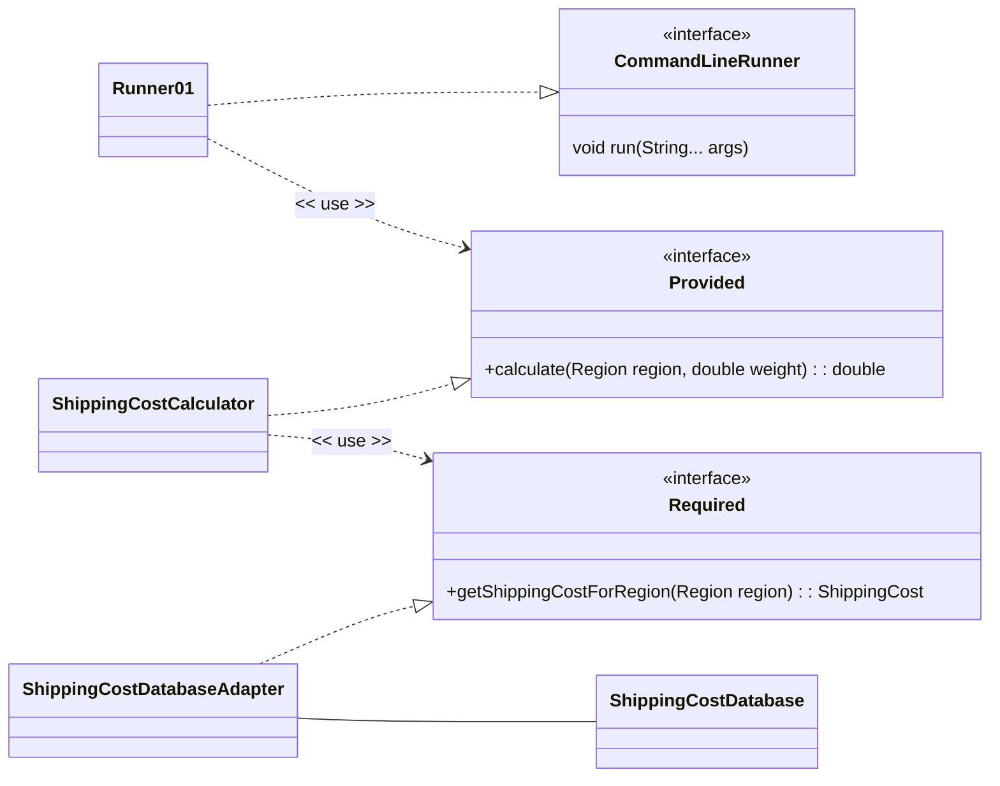

# Software Design and Architecture Week09 Lab Worksheet

# Convert a Ports and Adapters architecture to Spring

This lab will set up a basic Spring Boot application that uses Dependency Injection to manage a Ports and Adapters architecture.

> ⚠ This lab assumes you have completed the Spring Framework and Dependency Injection (DI) lab in a Week08 and are familiar with creating and running Spring Boot applications in IntelliJ.
> If you have not done so, please complete that lab first.

## Set up a Spring Boot Application

We are going to create a simple Spring Boot application using the **Spring Initializr** web tool.

Go to the website https://start.spring.io create a starter project using the following settings

- **Project**: Maven
- **Language**: Java
- **Spring Boot**: Choose latest stable (at time of writing this was 4.0.3)
- **Project Metadata**
    - Group: uk.ac.mmu
    - Artifact: lab0901
    - Name: lab0901
    - Package name: uk.ac.mmu.lab0901
    - Packaging: Jar
    - Configuration: Properties
    - Java: 25 (or higher)
- **Dependencies**: No dependencies are required for this lab.

Click the "Generate" button to download a zip file containing the starter project. Unzip the file and open the project in IntelliJ (be careful to open the project at the right level - the project should be opened from the directory containing the pom.xml file).

> ☠ Do not attempt to put Spring Boot projects into existing IntelliJ projects. Always create a new project for Spring Boot applications. This is because Spring Boot projects have a specific structure and configuration and use a build system called **Maven** that will conflict with existing projects.

A successful build and run should display the Spring Boot startup messages in the console (your exact output will probably be different)

```Text
  .   ____          _            __ _ _
 /\\ / ___'_ __ _ _(_)_ __  __ _ \ \ \ \
( ( )\___ | '_ | '_| | '_ \/ _` | \ \ \ \
 \\/  ___)| |_)| | | | | || (_| |  ) ) ) )
  '  |____| .__|_| |_|_| |_\__, | / / / /
 =========|_|==============|___/=/_/_/_/

 :: Spring Boot ::                (v4.0.3)

uk.ac.mmu.lab0901.Lab0901Application     : Starting Lab0901Application
uk.ac.mmu.lab0901.Lab0901Application     : No active profile set, falling back to 1 default profile: "default"
uk.ac.mmu.lab0901.Lab0901Application     : Started Lab0901Application in 0.506 seconds (process running for 0.767)
```

> ⚠ The details of your banner may vary depending on the date, version of Spring Boot, project settings, and other factors

Now create a class that implements the `org.springframework.boot.CommandLineRunner` and `org.springframework.core.Ordered` interfaces

```Java
package uk.ac.mmu.lab0901;

import org.springframework.stereotype.Component;

@Component
class Runner01 implements org.springframework.boot.CommandLineRunner, org.springframework.core.Ordered {
  Runner01() {

  }


  @Override
  public void run(String... args) {
    System.out.format("Hello from %s%n", this.getClass());
  }

  @Override
  public int getOrder() {
    return org.springframework.core.Ordered.HIGHEST_PRECEDENCE;
  }
}
```
You should see the message `Hello from class uk.ac.mmu.lab0901.Runner01` appear in the console when you run the application. This shows that the Spring Boot application is running correctly.

## Creating a Shipping Cost application within a Ports and Adapters architecture using Spring Boot

Locate the **ShippingCostPortsAdaptors** project in Student code project. This is an example of a Ports and Adapters (Hexagonal) architecture in a simple application using manual assembly of the application. The lab task is to convert example to use Spring Boot to assemble the application.

Copy the `applicationcode` and `infrastructure` packages from the **ShippingCostPortsAdaptors** project in Student code repository to the `uk.ac.mmu.lab0901` package in your Spring Boot project.

Wire up the Spring Boot application to use the Shipping Cost Calculator code.

### Hints and Tips

You will need to change the package declarations at the top of each Java file to reflect the new package location and change imports as necessary.

The `Runner01` class will need to be modified to create and use an instance of the `Provided` instance (realized by `ShippingCostCalculator`). It needs to become a driving adapter for the application and located in the `infrastructure` package.



If this is done successfully, when you run the Spring Boot application, you should see output similar to the following in the console

```Text
uk.ac.mmu.lab0901.Lab0901Application     : Started Lab0901Application in 1.281 seconds (process running for 1.69)
Select a region to ship to (UK, EUR, ROW): ROW
Enter the weight of the package in kg: 10
Shipping cost to ROW: 55.000000
```

There should be no need to modify any of the code in the `applicationcode` package, thus demonstrating the separation of concerns provided by the Ports and Adapters architecture that allows us to put a driving or driven adapter on to the same application code.

Ensure your solution correctly places application code and infrastructure into the correct packages.

## Extension Lab (Advanced)

- Create a dummy implementation of the `Provided` interface, configure the Spring Boot application to use this dummy implementation. Demonstrate that the application still works.
- Create an alternate implementation of the `Required` interface, configure the Spring Boot application to use this dummy implementation. Demonstrate that the application still works.

# Add an administration function to the Shipping Cost Calculator Application using a Repository

> ⚠ This lab assumes you have completed the first part of this lab

The lab task is to merge the shipping cost administration function implemented by the **ShippingCostRepository** project in the Student code repository into the Spring Boot application created in the first part of the lab.

The idea is that before the shipping cost calculation function is run, the user will be prompted to enter the shipping cost data for each region (UK, EUR, ROW) via the console.

The application trace should show something like this when run:

```Text
Enter minCharge for: UK
0
Enter the cost per kg for: UK
10
ShippingCost[region=UK, minCharge=0.0, costPerKg=10.0]
Enter minCharge for: EUR
10
Enter the cost per kg for: EUR
20
ShippingCost[region=UK, minCharge=0.0, costPerKg=10.0]
ShippingCost[region=EUR, minCharge=10.0, costPerKg=20.0]
Enter minCharge for: ROW
20
Enter the cost per kg for: ROW
30
ShippingCost[region=ROW, minCharge=20.0, costPerKg=30.0]
ShippingCost[region=UK, minCharge=0.0, costPerKg=10.0]
ShippingCost[region=EUR, minCharge=10.0, costPerKg=20.0]
Select a region to ship to (UK, EUR, ROW):
EUR
Enter the weight of the package in kg: 100
Shipping cost to EUR: 2000.000000
```

### Hints and Tips

#### Provided Interfaces

Both the cost calculation and the administration interfaces are **provided** interfaces.

You could merge these into one interface, but it is better to keep them separate to follow the **Interface Segregation Principle (ISP)**.

You could provide both interfaces into the one runner class, but this could be considered a violation of the **Single Responsibility Principle (SRP)**, so it is better to create a separate runner class for the administration function and schedule it to run before the calculation runner class.

If you do this, you will need to create the console scanner once and pass it to both runner classes (you can only create a single instance of `Scanner(System.in)` in an application).

To do this you will need to add another Bean to the Spring Configuration class to provide the Scanner instance.

```Java
    @Bean
    @Scope("singleton")
    Scanner createScanner() {
        return new Scanner(System.in);
    }
```

The Spring container will automatically close the Scanner for you when the application ends, because Scanner implements the Closeable interface.

#### Required Interfaces

Both the Shipping Cost Query and the Shipping Cost Repository are **required** interfaces.

As with the example above, you could merge these into one interface, but it is better to keep them separate to follow the Interface Segregation Principle (ISP).

If you write two separate Adapter classes to implement these two required interfaces, the adapters will need to share the same underlying data storage.

**Question**: What lifetime scope should this data storage have?

# Convert the OrderWithDIP lab to a Ports and Adapters architecture

In a previous week the lab task was to refactor an Order that did not make use of the **DIP** (dependency inversion principle) to use the DIP to abstract the dependency on a default or alternative courier service.

The lab task is to convert your solution to use Ports and Adapters architecture and the Spring Boot DI Container.

Go to the website https://start.spring.io create a starter project using the following settings

- **Project**: Maven
- **Language**: Java
- **Spring Boot**: Choose latest stable (at time of writing this was 4.0.3)
- **Project Metadata**
    - Group: uk.ac.mmu
        - Artifact: lab0902
        - Name: lab0902
        - Description: Ports and Adapters in Spring
        - Package name: uk.ac.mmu.lab0902
        - Packaging: Jar
        - Configuration: Properties
        - Java: 25 (or higher)
- **Dependencies**: No dependencies are required for this lab.

Click the "Generate" button to download a zip file containing the starter project. Unzip the file and open the project in IntelliJ (be careful to open the project at the right level - the project should be opened from the directory containing the pom.xml file).

> ☠ Do not attempt to put Spring Boot projects into existing IntelliJ projects. Always create a new project for Spring Boot applications. This is because Spring Boot projects have a specific structure and configuration and use a build system called **Maven** that will conflict with existing projects.

A successful build and run should display the Spring Boot startup messages in the console (something like)
```Text
  .   ____          _            __ _ _
 /\\ / ___'_ __ _ _(_)_ __  __ _ \ \ \ \
( ( )\___ | '_ | '_| | '_ \/ _` | \ \ \ \
 \\/  ___)| |_)| | | | | || (_| |  ) ) ) )
  '  |____| .__|_| |_|_| |_\__, | / / / /
 =========|_|==============|___/=/_/_/_/

 :: Spring Boot ::                (v4.0.3)

uk.ac.mmu.lab0902.Lab0902Application     : Starting Lab0902Application
uk.ac.mmu.lab0902.Lab0902Application     : No active profile set, falling back to 1 default profile: "default"
uk.ac.mmu.lab0902.Lab0902Application     : Started Lab0902Application in 0.519 seconds (process running for 0.769)
```

## Hints and Tips

As before, add a class that implements the `org.springframework.boot.CommandLineRunner` and `org.springframework.core.Ordered` interfaces. This will be the driving adapter for the application.

Your solution should be able to create orders that use either the default courier or the alternative courier. Use the Spring [profiles](https://docs.spring.io/spring-boot/reference/features/profiles.html) feature to switch between default and alternative couriers.

You will need to add a line to the `application.properties` file

`spring.profiles.active=default`

and then change the property value to a different string ("alt") to change couriers.

Ensure your solution correctly places application code and infrastructure into the correct packages.

## Using Spring Shell (Advanced)

This is very optional. In our examples so far, we have used the CommandLineRunner interface to run code when the application starts and this is fine for our examples and for supporting the assessment code.

However, Spring Boot also supports a more interactive approach using Spring Shell. This allows you to create a command-line interface (CLI) for your application where you can type commands to execute different functions. If you are comfortable with Spring Boot and want to explore further, you can look into using Spring Shell to create an interactive CLI.

See [Spring Shell Documentation](https://docs.spring.io/spring-shell/reference/index.html).
