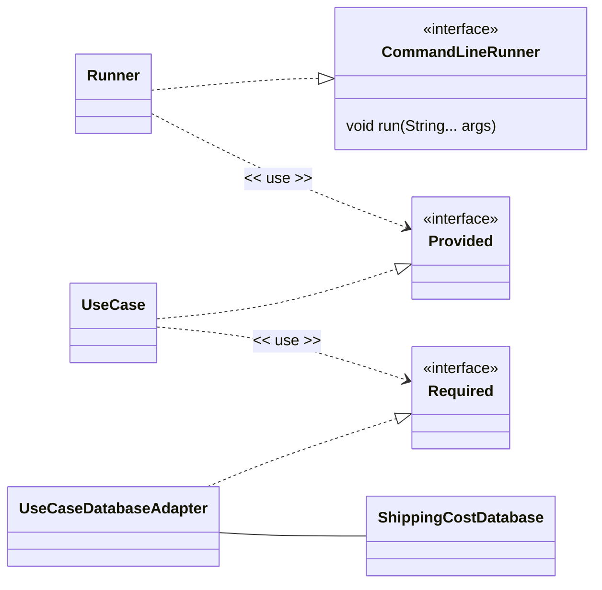

# Software Design and Architecture Week10 Worksheet

# Implement a Clean architecture in Spring

This lab will set up a basic Spring Boot application that uses Dependency Injection to manage a Clean architecture.

> ⚠ This lab assumes you have completed the Spring Framework and Dependency Injection (DI) labs in previous weeks and are familiar with creating and running Spring Boot applications in IntelliJ.
> If you have not done so, please complete those labs first.

## Set up a Spring Boot Application

We are going to create a simple Spring Boot application using the **Spring Initializr** web tool.

Go to the website https://start.spring.io create a starter project using the following settings

- **Project**: Maven
- **Language**: Java
- **Spring Boot**: Choose latest stable (at time of writing this was 4.0.3)
- **Project Metadata**
    - Group: uk.ac.mmu
    - Artifact: lab10
    - Name: lab10
    - Package name: uk.ac.mmu.lab10
    - Packaging: Jar
    - Configuration: Properties
    - Java: 25 (or higher)
- **Dependencies**: No dependencies are required for this lab.

Click the "Generate" button to download a zip file containing the starter project. Unzip the file and open the project in IntelliJ (be careful to open the Project at the right level - the project should be opened from the directory containing the pom.xml file).

> ☠ Do not attempt to put Spring Boot projects into existing Intelli-J projects. Always create a new project for Spring Boot applications. This is because Spring Boot projects have a specific structure and configuration and uses a build system called **Maven** that will conflict with existing projects.

A successful build and run should display the Spring Boot startup messages in the console.

```Text
.   ____          _            __ _ _
 /\\ / ___'_ __ _ _(_)_ __  __ _ \ \ \ \
( ( )\___ | '_ | '_| | '_ \/ _` | \ \ \ \
 \\/  ___)| |_)| | | | | || (_| |  ) ) ) )
  '  |____| .__|_| |_|_| |_\__, | / / / /
 =========|_|==============|___/=/_/_/_/

  :: Spring Boot ::                (v4.0.3)

uk.ac.mmu.lab10.Lab10Application         : Starting Lab10Application using Java 25.0.1
uk.ac.mmu.lab10.Lab10Application         : No active profile set, falling back to 1 default profile: "default"
uk.ac.mmu.lab10.Lab10Application         : Started Lab10Application in 1.13 seconds (process running for 1.694)
```

> ⚠ The details on your banner may vary depending on the date, version of Spring Boot, project settings and other factors

Now create a class that implements the `org.springframework.boot.CommandLineRunner` and `org.springframework.core.Ordered` interfaces

```Java

import org.springframework.core.Ordered;
import org.springframework.stereotype.Component;

@Component
class Runner01 implements org.springframework.boot.CommandLineRunner, org.springframework.core.Ordered {

    Runner01() {

    }


    @Override
    public void run(String... args)  {
        System.out.format("Hello from %s%n", this.getClass());
    }

    @Override
    public int getOrder() {
        return org.springframework.core.Ordered.HIGHEST_PRECEDENCE;
    }
}
```
You should see the message `Hello from class uk.ac.mmu.lab10.Runner01` appear in the console when you run the application.

## Creating a Shipping Cost Calculator application in Spring Boot

Copy the `applicationcode` and `infrastructure` packages from the **ShippingCostCleanArchitecture** project in Student code repository to the `uk.ac.mmu.lab10` package in your Spring Boot project.

Wire up the Spring Boot application to use the Shipping Cost Calculator code.

 ### Hints and Tips

You will need to change the package declarations at the top of each Java file to reflect the new package location and change imports as necessary.

The `Runner` class (the class that implements the org.springframework.boot.CommandLineRunner and org.springframework.core.Ordered interfaces) will need to be modified to create and use a the `Provided` instance. It needs to become a driving adapter for the application and be located in the infrastructure package.



If all is well, when the application is run you should see output similar to

```Text
Calculate Shipping using calculate method:
Select a country to ship to (DE,NZ,VA,RO,DK,RS,RU,AD,ZA,AL,SE,HR,SI,HU,EE,AT,AU,SK,SM,LI,LT,LU,LV,IE,ES,BA,BE,BG,PL,IN,PT,MC,MD,ME,IS,IT,BR,MK,FI,BY,MT,FR,CA,MX,CH,UA,JP,CN,GB,NL,CY,NO,US,CZ,GR): GR
Enter the weight of the package in kg: 98
Shipping cost to GR: 122.500000

```

### Initializing the Database

In the original code we wrote a `ShippingCostDatabaseInitializer` class that executed the applicationcode.usecase.putregion use case.

```Java
public class ShippingCostDatabaseInitializer {
    private final Provided putRegions;

    public ShippingCostDatabaseInitializer(Provided putRegions) {
        this.putRegions = putRegions;
    }
    // Define regions and their properties
    public void initializeDb(){

        Region uk = new Region("UK", "United Kingdom", 0.0, 0.0);
        uk.addCountry(new Country("GB", "United Kingdom"));
        //add other  countries
        //execute the use case
        putRegions.put(Set.of(uk, eur, row));
    }
}
```

One way to initialize the database in the Spring Boot application is to initialize it in a `Runner` class and ensure that executes first by setting the order to HIGHEST_PRECEDENCE.

```Java
import applicationcode.usecase.putregion.Country;
import applicationcode.usecase.putregion.Provided;
import applicationcode.usecase.putregion.Region;
import java.util.List;
import java.util.Set;

@Component
class DatabaseInitializer implements org.springframework.boot.CommandLineRunner, org.springframework.core.Ordered {

    private final Provided provided;

    DatabaseInitializer(Provided provided) {
        this.provided = provided;
    }

    @Override
    public void run(String... args) {

        System.out.format("%s initializing database%n", this.getClass());

        Region uk = new Region("UK", "United Kingdom", 0.0, 0.0);
        uk.addCountry(new Country("GB", "United Kingdom"));

        //rest of regions
        //execute the use case
        provided.put(Set.of(uk, eur, row));

    }

    @Override
    public int getOrder() {
        return org.springframework.core.Ordered.HIGHEST_PRECEDENCE;
    }
}
```


# Use package-specific configuration classes (Advanced)

You will notice that the same interfaces names `Provided` and `Required` are used across the different use cases in the applicationcode.usecase packages.
Writing the Spring `@Configuration` class will therefore require fully qualified names to distinguish between the different interfaces.

Another way to handle this is to create a separate `@Configuration` class in each package that requires configuration, i.e. one per use case and one for the infrastructure package.

## Finding @Configuration classes via Component Scanning
The application is annotated with `@SpringBootApplication` which is a *meta-annotation* that includes `@Configuration`, `@EnableAutoConfiguration` and `@ComponentScan`.

```Java
@SpringBootApplication
public class Lab10Application {

    public static void main(String[] args) {
        SpringApplication.run(Lab10Application.class, args);
    }

}
```
The `@ComponentScan` annotation tells Spring to scan the package of the class **and** all sub-packages for Spring components (classes annotated with `@Component`, `@Service`, `@Repository`, `@Controller`, etc.) and register them in the application context.

When we start a Spring application we provide a class to the `SpringApplication.run()` method. Passing `Lab10Application.class` to `SpringApplication.run()` tells Spring Boot where to start component scanning and configuration. It uses this class's package as the base package using recursive descent to find `@Component`, `@Configuration` and other Spring-managed beans.

Therefore, we can create multiple configuration classes in the sub-packages of `uk.ac.mmu.lab10` to configure each part of the application separately.

For example, you can create a configuration class for the `uk.ac.mmu.lab10.applicationcode.usecase.putregion` package like this:

```Java
package uk.ac.mmu.lab10.applicationcode.usecase.putregion;

import org.springframework.context.annotation.Bean;
import org.springframework.context.annotation.Configuration;
import org.springframework.context.annotation.Scope;

@Configuration("putRegionConfiguration")
class AppConfig {
    @Bean("putRegion")
    @Scope("prototype")
    Provided create(Required required) {
        return new UseCase(required);
    }
}
```
Spring's internal component scanning will find this configuration class and register the bean for the `putRegion` use case. However, we still some work to do because Spring registers beans using a bean name that is the same as the class or method name by default.

If we create `@Component` classes of the same name, or multiple `@Bean` methods with the same name, Spring will not know which one is which, so we need to disambiguate them using a unique name.

We provide unique names for the configuration classes and bean methods by adding a name to the `@Configuration` and `@Bean` annotations respectively.

In this case `@Configuration("putRegionConfiguration")` names the configuration bean as `putRegionConfiguration` and `@Bean("putRegion")` names the use case bean as `putRegion`.

> ☑ Note that once you have package-specific configuration classes like this, you can remove all the public constructors from your classes (the interfaces will remain public) because
>
> 1. The configuration class will be in the same package and can therefore access package-private constructors.
> 2. Spring Boot will discover the configuration class automatically via component scanning and read them using reflection, so there is no need for public constructors.
>
> ⚠ There are some rules about where the SpringBoot application will scan for classes marked `@Configuration` at start up time that you need to be aware of.

**Questions**

Some questions to consider as you work through this lab:

1. Is having public classes or interfaces with the same name in different packages a good idea?
2. Should my interfaces always contain the words "Provided" and "Required"?
3. Are package-specific Spring configuration classes a good idea?

There are no right or wrong answers to these questions, there are pros and cons - consider the tradeoffs and what circumstances you would answer yes or no.

The questions will be discussed in the lab solutions document.

# Create a version of the Calculate Shipping Use Case using the Request-Response Model pattern

> ⚠ This lab assumes you have completed the first part of this lab

The task is to create a new use case based on the `Provided` interface for the `calculateshipping` use case using the Request-Response Model pattern.
The existing interface as defined:

```Java
public interface Provided {
    double calculate(String countryCode, double weight);
}

```

Create a new package in the `applicationcode` package called `calculateshippingrequestresponse`.

Create another CliAdapter class in the `infrastructure` package and configure it to run after the existing `ShippingCostCliAdapter` class. This will be used to run your new use case.

```Java
@Component
public class ShippingCostRequestResponseCliAdapter  implements org.springframework.boot.CommandLineRunner, org.springframework.core.Ordered {

    @Override
    public void run(String... args) throws Exception {
    }
        @Override
    public int getOrder() {
        return org.springframework.core.Ordered.HIGHEST_PRECEDENCE + 2;
    }
}
```

Copy the code from the `calculateshipping` package into this new package. You will need to deal with package declarations and imports and ensure that the classes in your new package are being configured by the Spring Boot application correctly.

> ⚠ You might find that using package-specific configuration classes (one for each package) will make this easier to manage. This was covered in the advanced part of Lab01.

Get the ShippingCostRequestResponseCliAdapter to run the use case.

Create a request object class called `Request` in the `calculateshippingrequestresponse` package that encapsulates the input parameters for the `calculate` method.

```Java
public class Request {
    private final String countryCode;
    private final double weight;

    public Request(String countryCode, double weight) {
        //Validation code here
    }
}
```

Create a response object class called `Response` in the `calculateshippingrequestresponse` package that encapsulates the output parameters for the `calculate` method.

```Java
public class Response {

    private final String countryCode;
    private final double weight;
    private final String regionCode;
    private final double cost;


    public Response(String countryCode, double weight, String regionCode, double cost) {
        this.countryCode = countryCode;
        this.weight = weight;
        this.regionCode = regionCode;
        this.cost = cost;
    }
}
```
Change the provided interface and the use case implementation to use the new request and response objects.

```Java
public interface Provided {
    Response handle(Request request);
}
```
Change the `ShippingCostRequestResponseCliAdapter` class to use your new request and response objects.

When you run the application, you should see the same output as in Lab 01, but this time using the Request-Response Model pattern.

### Using the Scanner in multiple runners

Where there is more than one runner that uses the scanner, you will need to inject it using another Bean in the Spring Configuration class to provide the Scanner instance.

```Java
    @Bean
    @Scope("singleton")
    Scanner createScanner() {
        return new Scanner(System.in);
    }
```

The Spring container will automatically close the Scanner for you when the application ends (this is because Scanner implements the Closeable interface).

### Hints and Tips

If we have created a Use Case class for each action that a driving actor can take, then we can standardise on UseCase classes having a single method that takes a Request object and returns a Response object.

These are like Value Objects in that they are immutable and contain only data, but they are different to Value Objects because they specific to the Use Case and are not shared across different Use Cases. They do not implement the `equals` and `hashCode` methods because as they are not used in collections or compared for equality. Implementing `toString` can be useful for debugging.

> ⚠ You may see the terms "input model" and "output model" used instead of request and response objects. The word "model" conflicts with the "domain model" (meaning the entities, value objects and services modelling the business domain) and so we will use request and response to mean the input and output of a Use Case.

### Request Objects

We can now validate the inputs to the use case in the Request constructor, so the Use Case implementation can assume that the inputs are valid.

This places the responsibility for validating the inputs to the Request object in the Request class itself, rather than in the Use Case implementation and the Use Case implementation takes responsibility for validating the business rules using the domain model or queries to the database (only the Use Case implementation has access to the domain model in this architecture).

> ☑ Validation is a reason that it is not recommended to share request classes across different Use Case implementations, in addition to creating a coupling between Use Cases, each Use Case will have its own specific validation requirements.

### Response Objects

Like request objects, response objects are immutable and contain only data specific to the Use Case. Like request objects they do not need to implement the `equals` and `hashCode` methods because they are not used in collections or compared for equality, although implementing `toString` can be useful for debugging.

> ☑ It is not recommended to share response classes across different Use Case implementations. Again this would create coupling between Use Cases but response classes would potentially end up with optional fields which are set by some use cases and not by others, which would leak implementation details from one use case to another.

**Question**  What are the advantages and disadvantages of the Request-Response Model pattern compared to using multiple parameters on a Use Case interfaces ?

# Convert the Request-Response classes to Java Records (Advanced)

A request or response class is a kind of **Data Transfer Object (DTO)** - classes that contain only immutable data and have no behavior.

Java **record classes** (introduced in Java 16) provide a way to create immutable data classes with minimal boilerplate code.

Java record classes support validation, so you can add validation logic to ensure that the data is valid when the record is created (as we did with the request class earlier).

Convert the `Request` and `Response` classes to Java Records using the documentation on [Java Records](https://docs.oracle.com/en/java/javase/17/language/records.html).

# Wrap a logging Decorator around the Request-Response version of the shipping cost calculation Use Case (Advanced)

The request-response version of a use case works well with the decorator pattern because there is a standard method signature for the use case interface. Adding additional properties to the request and response objects does not change the method signature.

Create a decorator class called CalculateShippingRequestResponseUseCaseDecorator in the `infrastructure.driving` package that implements the `Provided` interface for the request-response version of the shipping cost calculation use case.

> ⚠ We met the decorator pattern earlier in the module, review that section if you need a reminder of how the pattern works.

```Java
package uk.ac.mmu.lab10.infrastructure.driving;

import uk.ac.mmu.lab10.applicationcode.usecase.calculateshippingrequestresponse.Request;
import uk.ac.mmu.lab10.applicationcode.usecase.calculateshippingrequestresponse.Response;
import uk.ac.mmu.lab10.applicationcode.usecase.calculateshippingrequestresponse.Provided;

public class CalculateShippingRequestResponseUseCaseDecorator implements Provided {

    private double totalCost;
    private final Provided decoratee;

    public CalculateShippingRequestResponseUseCaseDecorator(Provided decoratee) {
        this.decoratee = decoratee;
    }


    @Override
    public Response handle(Request request) {
        System.out.format("%s%n", request);
        Response response = decoratee.handle(request);
        System.out.format("%s%n", response);
        return response;
    }
}
```
The challenge here is to get the Spring configuration to wrap the existing Use Case implementation with this decorator.

If configured correctly, when you run the application you should see the request and response objects printed to the console by the decorator.

```Plain Text
Select a country to ship to (RO,DK,RS,RU,AD,ZA,AL,SE,HR,SI,HU,EE,AT,AU,SK,SM,LI,LT,LU,LV,IE,ES,BA,BE,BG,PL,IN,PT,MC,MD,ME,IS,IT,BR,MK,FI,BY,MT,FR,CA,MX,CH,UA,JP,CN,GB,NL,CY,NO,US,CZ,GR,DE,NZ,VA): NZ
Enter the weight of the package in kg: 10
Request[countryCode=NZ, weight=10.0]
Response[countryCode=NZ, weight=10.0, regionCode=ROW, cost=55.0]
Shipping cost of 10.000000kg to NZ (ROW): 55.000000
```
## Using Spring Shell (Advanced)

This is very optional. In our examples so far, we have used the CommandLineRunner interface to run code when the application starts and this is fine for our examples and for supporting the assessment code.

However, Spring Boot also supports a more interactive approach using Spring Shell. This allows you to create a command-line interface (CLI) for your application where you can type commands to execute different functions. If you are comfortable with Spring Boot and want to explore further, you can look into using Spring Shell to create an interactive CLI.

See [Spring Shell Documentation](https://docs.spring.io/spring-shell/reference/index.html).
